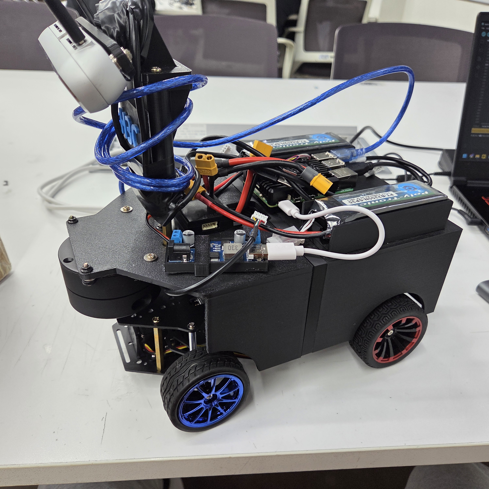
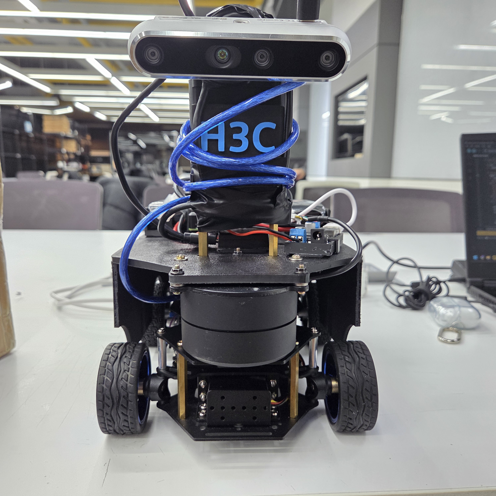
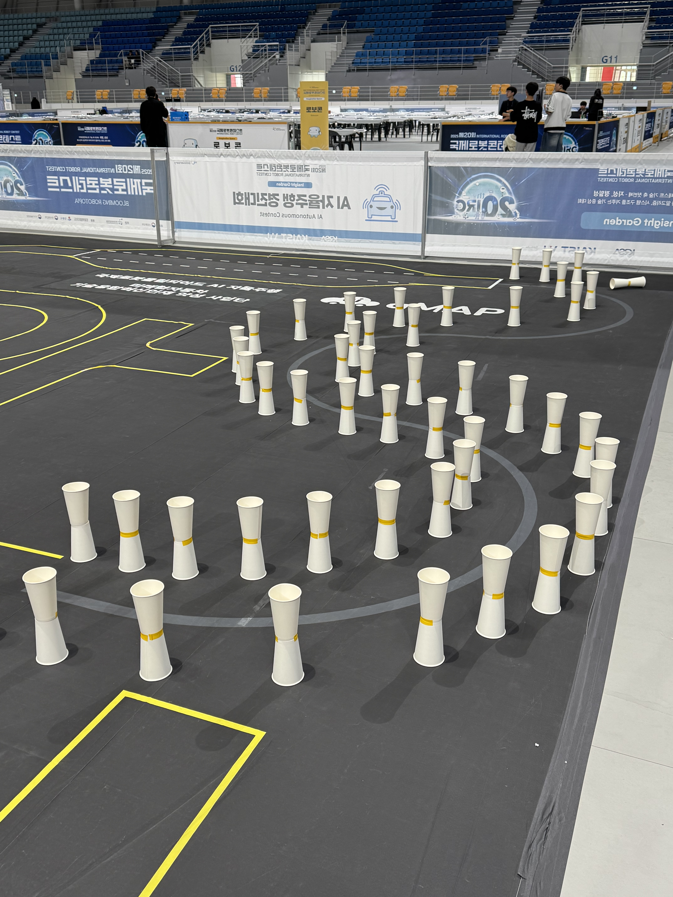

# Lidar_drive_competition

## 한국어

<p align="center">
  
  
  
</p>

IRO 콘 주행 대회에서 진행한 LiDAR 기반 자율주행 프로젝트입니다. 별도의 카메라나 GPS 없이 LiDAR 스캔만으로 콘 사이를 주행하는 반응형 제어기를 만들었습니다. 결론부터 말하면 최종 주행에서 안정적으로 완주하지 못했고, 그 원인을 분석해서 정리했습니다.

### 내가 한 것

`/scan` 토픽을 받아서 조향 명령까지 이어지는 파이프라인을 처음부터 직접 구현했습니다.

- 각도-인덱스 보정 (센서 장착 각도 기준 맞추기)
- 섹터 단위 거리 추출 (좌/우/전방)
- 노이즈 필터링 (유효 범위 필터 + 하위 백분위수 집계 + EMA)
- 좌우 거리 차이 기반 조향 계산

드라이버 파라미터도 직접 수정하고, 실패 원인을 분석해서 인지 로직도 고쳤습니다.

### 파이프라인 구조

```
LaserScan -> 섹터 추출 -> 좌/우/전방 거리 -> 조향 명령
```

좌우 거리 차이로 조향값을 계산하고, 양쪽 콘이 모두 감지되지 않으면 복구 모드로 전환합니다.

### 왜 실패했나

두 가지 문제가 있었습니다.

**1. 센서 방향 설정 오류**
LiDAR가 물리적으로 뒤집혀 장착된 상태에서 드라이버 설정을 그대로 사용했습니다. 실제 방향과 설정이 반대였으니 좌/우 거리가 뒤집혀 들어오는 상황이었습니다.

**2. 센서와 환경의 불일치**
YDLIDAR G6는 이 대회 환경에 맞지 않았습니다. 콘 간격이 좁고 감지 거리가 매우 짧아서, 해당 센서의 근거리 성능으로는 안정적인 인식이 어려웠습니다.

### 고쳐본 것들

- 불안정한 반사값 줄이기 위해 스캔 파라미터 수정
- 비현실적인 중앙 감지값 무시하는 임계값 추가
- 단순 거리 차이 기반으로 제어기 구조 단순화

결과적으로 완주는 못 했지만, 제어기 튜닝 전에 센서 장착 방향부터 검증해야 한다는 것과 센서 선택이 환경에 맞아야 한다는 것을 직접 경험했습니다.

### 파일 설명

- `scan_angle_debug.py` — 각도-인덱스 매핑 검증
- `sector_extractor.py` — 원시 스캔을 섹터 거리로 변환
- `cone_controller.py` — 거리 차이로 조향 계산
- `ydlidar_g6_cone.yaml` — 드라이버 설정
- `failure_analysis.md` — 실패 원인 및 수정 내용 정리

---

## English

<p align="center">
  
  
  
</p>

LiDAR-only reactive navigation for the IRO cone driving competition. No camera, no GPS — just raw scan data to steer a robot between cones. The final run didn't complete reliably, and this repo documents what was built and what went wrong.

### What I built

The full pipeline from `/scan` to steering commands:

- Angle-index calibration for the mounted sensor
- Sector-based distance extraction (left / right / front)
- Noise filtering via valid-range filter, lower-percentile aggregation, and EMA smoothing
- Difference-based steering with recovery fallback when both sides drop out

I also debugged the driver parameters and revised the perception logic after identifying the failure modes.

### Pipeline

```
LaserScan -> sector extraction -> left/right/front distances -> steering command
```

### Why it failed

**1. Sensor orientation mismatch**
The LiDAR was physically mounted upside-down, but the driver was left at default. Left and right were swapped at the hardware level.

**2. Wrong sensor for the job**
The YDLIDAR G6 struggled with this specific course layout. The cone spacing was tight and the required detection range was short — conditions where the sensor's near-range performance wasn't reliable enough.

### Fixes tried

- Adjusted scan parameters to reduce unstable returns
- Added a threshold to discard implausible center-distance readings
- Simplified the controller to pure distance-difference steering

The run still didn't complete, but working through the failures was useful. The main takeaway: verify sensor mounting direction before tuning the controller, and check that the sensor's characteristics actually match the task geometry.

### Files

- `scan_angle_debug.py` — angle-index mapping verification
- `sector_extractor.py` — raw scan to sector distances
- `cone_controller.py` — steering from distance difference
- `ydlidar_g6_cone.yaml` — driver config
- `failure_analysis.md` — failure analysis and attempted fixes
